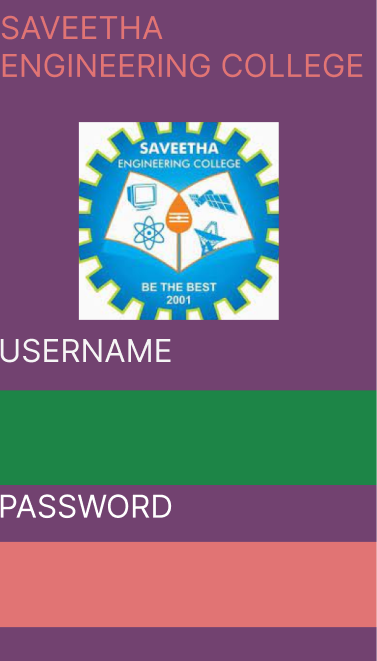
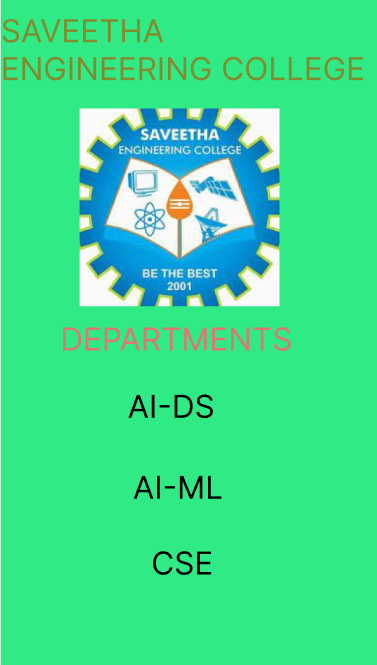

# Event Registration Web Application

## AIM:
To design, develop and deploy a web application for event registration.

## DESIGN STEPS:
## Step 1:
Create a new frame.

## Step 2:
Select any one preset size of your choice.

## Step 3:
Select the shapes you need.

## Step 4:
Import images as needed.

## Step 5:
Create pages based on your need and link them.

## Step 6:
Validate the HTML and CSS code.

## Step 7:
Publish the website in the given URL.

## DESIGN TOOL:
FIGMA

## PROGRAM :
```
/* Home Page */


position: relative;
width: 360px;
height: 640px;

background: #75AAB6;
box-shadow: 0px 4px 4px rgba(0, 0, 0, 0.25);
position: absolute;
width: 360px;
height: 71px;
left: 19px;
top: 16px;

font-family: 'Inter';
font-style: normal;
font-weight: 400;
font-size: 30px;
line-height: 36px;

color: #2FEA85;
position: absolute;
width: 154px;
height: 140px;
left: 88px;
top: 99px;

background: url(download.jpg);
position: absolute;
width: 340px;
height: 79px;
left: 10px;
top: 262px;

font-family: 'Inter';
font-style: normal;
font-weight: 400;
font-size: 30px;
line-height: 36px;

color: #B73636;
/* NIRF Ranked Autonomous Institution */


position: absolute;
width: 333px;
height: 110px;
left: 17px;
top: 364px;

font-family: 'Inter';
font-style: normal;
font-weight: 400;
font-size: 30px;
line-height: 36px;

color: #140304;
/* Rectangle 1 */


position: absolute;
width: 326px;
height: 108px;
left: 16px;
top: 464px;

background: #A07D72;
/* Login Page */


position: relative;
width: 360px;
height: 640px;

background: #724270;
/* USERNAME */


position: absolute;
width: 206px;
height: 57px;
left: 0px;
top: 320px;

font-family: 'Inter';
font-style: normal;
font-weight: 400;
font-size: 30px;
line-height: 36px;

color: #F5F5F5;
/* Rectangle 3 */


position: absolute;
width: 360px;
height: 90px;
left: 0px;
top: 376px;

background: #1D8547;
/* PASSWORD */


position: absolute;
width: 206px;
height: 70px;
left: 0px;
top: 468px;

font-family: 'Inter';
font-style: normal;
font-weight: 400;
font-size: 30px;
line-height: 36px;

color: #FFFFFF;
/* Rectangle 4 */


position: absolute;
width: 360px;
height: 81px;
left: 0px;
top: 520px;

background: #E17474;
/* Department */


position: relative;
width: 360px;
height: 640px;

background: #2FEA85;
/* DEPARTMENTS */


position: absolute;
width: 343px;
height: 40px;
left: 6px;
top: 310px;

font-family: 'Inter';
font-style: normal;
font-weight: 400;
font-size: 30px;
line-height: 36px;

color: #E17474;
/* AI-DS */


position: absolute;
width: 204px;
height: 55px;
left: 70px;
top: 374px;

font-family: 'Inter';
font-style: normal;
font-weight: 400;
font-size: 30px;
line-height: 36px;

color: #000000;
/* AI-ML */


position: absolute;
width: 207px;
height: 52px;
left: 75px;
top: 451px;

font-family: 'Inter';
font-style: normal;
font-weight: 400;
font-size: 30px;
line-height: 36px;

color: #000000;
/* CSE */


position: absolute;
width: 198px;
height: 70px;
left: 84px;
top: 523px;

font-family: 'Inter';
font-style: normal;
font-weight: 400;
font-size: 30px;
line-height: 36px;

color: #000000;
```


## OUTPUT:




## Result:
The Program is executed Successfully

